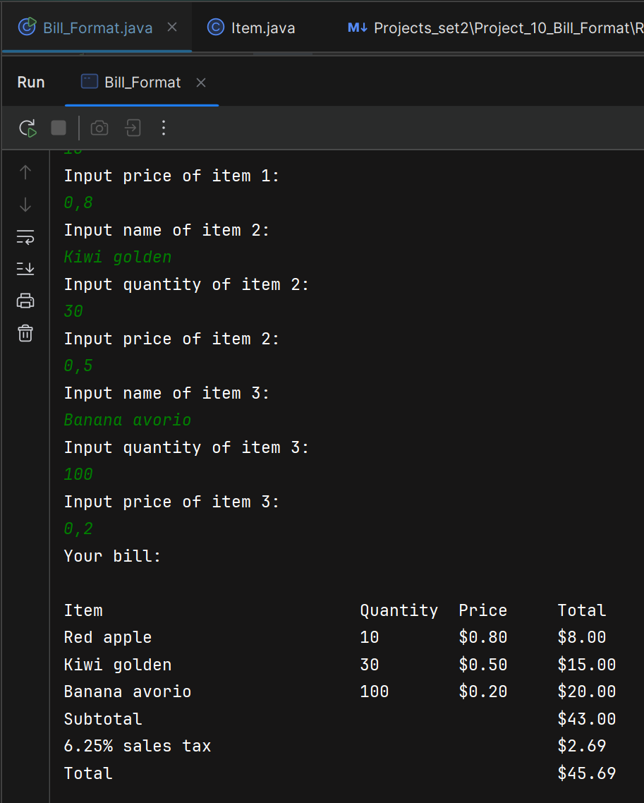

Write a program that inputs the name, quantity, and price of three items. The
name may contain spaces. Output a bill with a tax rate of 6.25%. All prices should
be output to two decimal places. The bill should be formatted in columns with
30 characters for the name, 10 characters for the quantity, 10 characters for the
price, and 10 characters for the total. Sample input and output are shown as follows:
Input name of item 1:
lollipops
Input quantity of item 1:
10
Input price of item 1:
0.50
Input name of item 2:
diet soda
Input quantity of item 2:
3
Input price of item 2:
1.25
Input name of item 3:
chocolate bar
Input quantity of item 3:
20
Input price of item 3:
0.75
Your bill:
| Item           | Quantity | Price | Total |
|:---------------|--------:|-----:|-----:|
| lollipops      |      10 |  0.50 |  5.00 |
| diet soda      |       3 |  1.25 |  3.75 |
| chocolate bar  |      20 |  0.75 | 15.00 |
| Subtotal       |         |       | 23.75 |
| 6.25\% sales tax |       |       |  1.48 |
| Total          |         |       | 25.23 |

---

## Overview

This project reads three items (name may contain spaces), 
their quantities and prices, then prints a formatted bill with a 6.25% sales tax. 
Currency values are displayed with two decimal places and aligned into columns.

## Files

\- `src/Projects_set2/Project_10_Bill_Format/Item.java`  
\- `src/Projects_set2/Project_10_Bill_Format/Bill_Format.java`

## `Item.java` (purpose and behavior)

\- Purpose: simple data holder for a single invoice line.  
\- Fields: `private final String name;`, `private final int quantity;`, `private final double price;`.  
\- Constructor: sets the three fields.  
\- Accessors: `getName()`, `getQuantity()`, `getPrice()`.  
\- Computation: `getTotal()` returns `quantity * price` (a `double`) representing the line total.

## `Bill_Format.java` (flow and key details)

\- Constants: `IT` (number of items, currently 3) and `TAX_RATE` (0.0625).  
\- Input loop: uses `Scanner` to read item name (with `nextLine()`), quantity (`nextInt()`), and price (`nextDouble()`); consumes the leftover newline after numeric reads. Each item is stored in `Vector<Item> items`.  
\- Totals: subtotal is the sum of each `Item.getTotal()`. Tax is computed as `subtotal * TAX_RATE` and rounded to cents with `Math.round(... * 100.0) / 100.0`. Total is subtotal + tax, rounded likewise. Rounding is used to avoid displaying tiny floating‑point artifacts.  
\- Formatting: `NumberFormat.getCurrencyInstance(Locale.US)` creates `moneyFormatter` used to display prices and totals as currency. Output alignment uses `System.out.printf` with column widths matching the assignment: 30 chars for name and 10 chars each for quantity, price, total (format strings like `%-30s%-10s%-10s%-10s`). The tax label is produced with `String.format("%.2f%% sales tax", TAX_RATE * 100)`.  
\- Printing: prints header then each item line using the formatter, then subtotal, tax line, and total using `moneyFormatter.format(...)`.

## Rationale for rounding

\- Binary floating point cannot exactly represent many decimal currency values; intermediate results can produce small precision errors (e.g., 1.4799999). Rounding to two decimal places before display ensures currency looks correct.  
\- Stronger alternative: use `BigDecimal` for all monetary calculations and rounding with `RoundingMode.HALF_UP` to avoid floating point errors entirely (recommended for production/financial code).

## Running the program

\- In IntelliJ: run `Bill_Format` as a Java application. Provide input when prompted.  
\- Command line: compile then run:
\- `javac -d out\production\Project src\...\Item.java src\...\Bill_Format.java`  
\- `java -cp out\production\Project Projects_set2.Project_10_Bill_Format.Bill_Format`

## Sample interaction (trimmed)

## Notes and possible improvements

\- Use `BigDecimal` for accurate monetary math and to avoid manual rounding.  
\- Validate inputs (non‑negative quantities, non‑negative prices).  
\- Handle item names longer than 30 characters (truncate or wrap if desired).  
\- Replace `Vector` with `ArrayList` unless thread safety is required (modern recommendation).