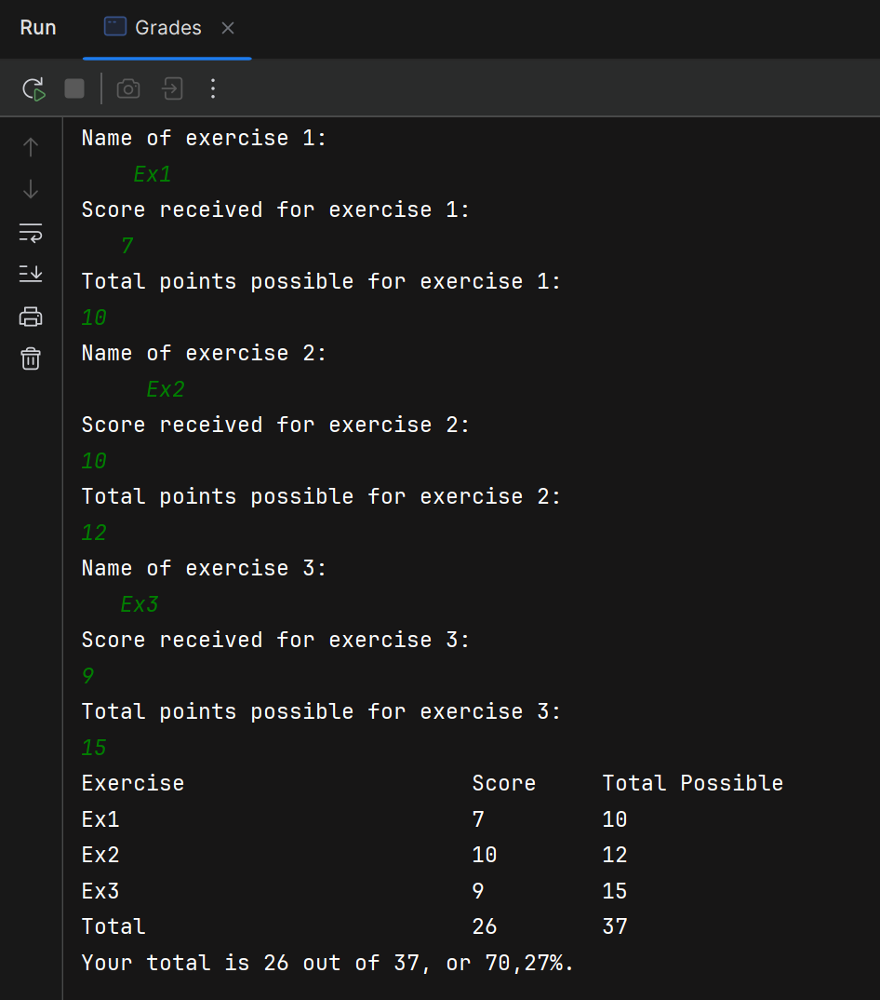

Write a program that calculates the total grade for three classroom exercises as a
percentage. Use the DecimalFormat class to output the value as a percent. The
scores should be summarized in a table. Input the assignment information in this
order: name of assignment (may include spaces), points earned (integer), and total
points possible (integer). The percentage is the sum of the total points earned divided
by the total points possible. Sample input and output are shown as follows:
Name of exercise 1:
Group Project
Score received for exercise 1:
10
Total points possible for exercise 1:
10
Name of exercise 2:
Homework
Score received for exercise 2:
7
Total points possible for exercise 2:
12
Name of exercise 3:
Presentation
Score received for exercise 3:
5
Total points possible for exercise 3:
8

| Exercise       | Score | Total Possible |
|---------------:|------:|---------------:|
| Group Project  |    10 |             10 |
| Homework       |     7 |             12 |
| Presentation   |     5 |              8 |
| **Total**      |   **22** |         **30** |

Your total is 22 out of 30, or 73.33\%.

---
# Grades Calculator

This small Java program reads information for three classroom exercises 
(name, points earned, and total points possible), summarizes them in a table, 
and prints the overall percent using `DecimalFormat`.

## Files
- `src/Projects_set2/Project_11_Grades/Grades.java` — main program: reads input, stores `Exercise` objects, prints the table and percentage.
- `src/Projects_set2/Project_11_Grades/Exercise.java` — immutable data class holding an exercise name, earned points, and max points.
- `Grades.PNG` — screenshot of sample program output (place next to this `README.md`).

## Requirements
- Java 11+ recommended (the code uses try-with-resources; variable-in-resource form requires Java 9+).
- A terminal / command prompt on Windows.

## Build and run
From the project root run:

```bash
javac -d out src/Projects_set2/Project_11_Grades/*.java
java -cp out Projects_set2.Project_11_Grades.Grades
```

Alternatively build/run from your IDE (IntelliJ IDEA 2025.2.3).

## Usage
The program prompts three times for:
1. Name of exercise (may include spaces)
2. Score received (integer)
3. Total points possible (integer)

After input it prints a table and the overall percentage.

## Example session

Input:
```
Name of exercise 1:
Group Project
Score received for exercise 1:
10
Total points possible for exercise 1:
10
Name of exercise 2:
Homework
Score received for exercise 2:
7
Total points possible for exercise 2:
12
Name of exercise 3:
Presentation
Score received for exercise 3:
5
Total points possible for exercise 3:
8
```

Output (table) and percentage:
```
Exercise                      Score     Total Possible
Group Project                 10        10
Homework                      7         12
Presentation                  5         8
Total                         22        30

Your total is 22 out of 30, or 73.33%.
```

## Important design choices
- Scanner lifecycle: `Scanner keyboard = new Scanner(System.in); try (keyboard) { ... }` — uses try-with-resources so the scanner is closed automatically. Note: this form requires Java 9+ and closing the scanner also closes System.in (avoid if other code needs stdin).
- Newline handling: after nextInt() call nextLine() to consume the trailing newline so subsequent nextLine() reads the full exercise name correctly.
- Formatting: `DecimalFormat("#0.00%")` to present the fraction as a percent with two decimals; System.out.printf with fixed column widths for a neat table.
- Division safety: compute percentage as `(totalMaxScore == 0) ? 0.0 : (double) currentTotScore / totalMaxScore` to prevent divide-by-zero.
- Data structure: code currently uses Vector<Exercise>; preferred choice for this single-threaded use is List<Exercise> / ArrayList<Exercise> (lighter, not synchronized).
- Immutability: Exercise fields are final and accessed via simple getters — small, easy-to-test value object.
- Constants: ASSIGNMENTS constant centralizes number of exercises for easy change.

Screenshot:
<div>
  
</div>

## Notes
- The program currently closes the `Scanner` (try-with-resources); closing a `Scanner` wrapping `System.in` will close `System.in` — avoid closing it if other code needs standard input later.
- Prefer `List<Exercise>` / `ArrayList` over `Vector` unless synchronized access is required.
- Division by zero is guarded: if total possible points is zero, the percentage shown is 0.00%.

